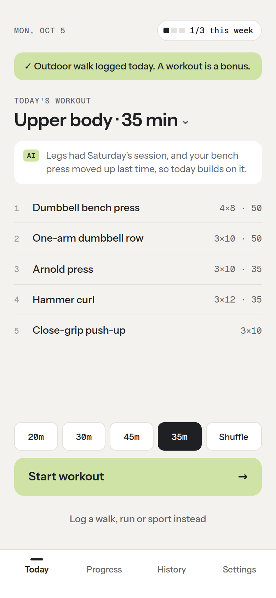
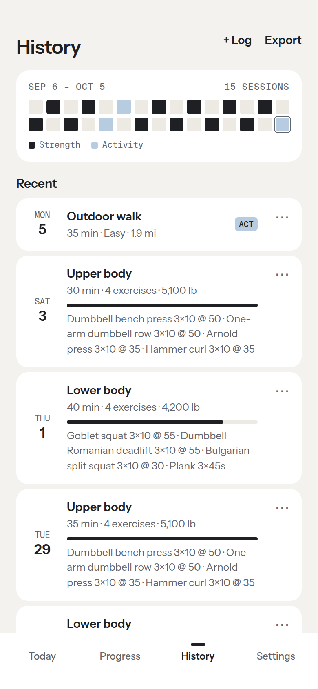
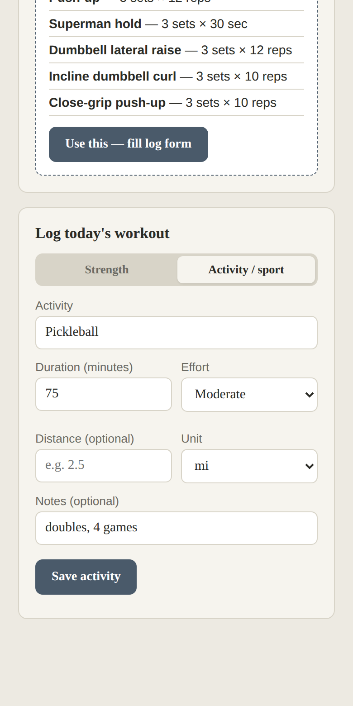

# Training Log

A mobile-first workout planner and tracker. Tell it how much time you have and what
you want to train, and it builds a workout that fits your equipment. Log strength
sessions and everyday activities, and sync your history across devices.

**Live app: [train.tejasrj.io](https://train.tejasrj.io)** (works without signing in)

<p>
  
  
  
</p>

## Features

- **Time-boxed workout suggestions.** Choose the minutes available and one of 14 focus
  areas (full body, upper, lower, push, pull, chest, back, shoulders, arms, legs,
  glutes, core, cardio, mobility). The app fills the time from a curated library of
  ~170 exercises.
- **Equipment-aware.** Toggle from 20 equipment presets or add your own; suggestions
  only use what you have. Bodyweight is always available.
- **History-aware.** Prefers exercises you haven't done recently and pre-fills your
  last logged weight for each one.
- **Strength and activity logging.** Log sets, reps and weight, or record activities
  like walks, runs, hikes and pickleball with duration, effort and distance.
- **AI suggestions.** Gemini plans workouts that also account for recent activity and
  fatigue, through a small proxy that keeps the API key off the client and enforces
  daily limits per user. Falls back to the library when a limit is reached or the
  call fails.
- **Local-first with cloud sync.** Works offline and signed out. Sign in with Google
  to sync across devices, or continue as a guest and link Google later.
- **Installable PWA.** Add to the home screen on iOS or Android; the app shell is
  cached for offline use.
- **Backup and restore.** Export and import all data as JSON.

## How it works

| Layer | Implementation |
|---|---|
| UI | Single-page vanilla HTML/CSS/JS, no build step or framework |
| Suggestions | Greedy time-budget packer over a curated library (`exercises.js`), rotating across muscle groups and ranked by how recently each exercise was done |
| Storage | `localStorage` is the source of truth on each device |
| Sync | Firebase Authentication (Google and anonymous) + Cloud Firestore |
| Offline | Service worker with stale-while-revalidate caching |
| AI | Gemini API behind a Cloudflare Worker (`worker/`) that verifies Firebase ID tokens and enforces tiered daily limits |
| Hosting | GitHub Pages with a custom domain |

**Sync model.** Every change is written locally first, then mirrored to
`users/{uid}/workouts/{id}` and `users/{uid}/settings/profile`. A sync runs on sign-in,
on demand, and when the app returns to the foreground. Workouts merge by id, deletions
on one device propagate to the others instead of being restored, and equipment
settings use last-write-wins.

## Project structure

```
index.html            App UI, state, logging, history, suggestions and sync logic
exercises.js          Exercise library, focus areas, equipment and the workout builder
firebase-sync.js      Firebase Auth + Firestore wrapper, loaded as an ES module
sw.js                 Service worker for offline support
manifest.webmanifest  PWA manifest
firestore.rules       Firestore security rules
icons/                App icons
docs/screenshots/     README images
worker/               Cloudflare Worker AI proxy (see worker/README.md)
```

## Running locally

No dependencies or build step. Serve the folder over HTTP (service workers and
Google sign-in don't work from `file://`):

```bash
python3 -m http.server 8000
# open http://localhost:8000
```

## Deployment

The site is served by GitHub Pages from the `main` branch. The `CNAME` file and a
DNS CNAME record point `train.tejasrj.io` at it.

To deploy your own copy:

1. Create a Firebase project, enable **Google** and **Anonymous** sign-in, and create a
   Firestore database.
2. Publish the rules in `firestore.rules`.
3. Replace the config object in `firebase-sync.js` with your project's web config.
4. Add your domain under Authentication → Settings → Authorized domains.
5. Enable GitHub Pages (or any static host) for the repository.

## Security and privacy

- The Firebase web config is a public identifier, not a secret. Access is enforced by
  the Firestore rules: each user can read and write only their own documents.
- The Gemini API key lives only in the Worker's secret store. The Worker accepts requests
  only from the app's origin, verifies Firebase ID tokens for signed-in users, and limits
  signed-out use per IP (stored hashed) and in total.
- All user- and model-generated text is HTML-escaped before rendering.

## Data model

```jsonc
// Strength workout
{
  "id": 1759276800000,
  "date": "2026-10-01T13:00:00.000Z",
  "duration": 35,
  "region": "upper",
  "exercises": [
    { "name": "Dumbbell bench press", "sets": 4, "reps": 8, "weight": 45 },
    { "name": "Plank", "sets": 3, "reps": 45, "weight": 0, "unit": "sec" }
  ]
}

// Activity
{
  "id": 1759363200000,
  "date": "2026-10-02T13:00:00.000Z",
  "type": "activity",
  "activity": "Outdoor walk",
  "duration": 40,
  "effort": "Easy",
  "distance": 2.3,
  "distanceUnit": "mi",
  "exercises": []
}
```

Exercise `unit` is omitted for reps, `"sec"` for timed sets and `"min"` for steady
cardio blocks.

## Roadmap

- [x] Time- and focus-based suggestions from a curated, equipment-aware library
- [x] Strength and activity logging with history
- [x] Installable PWA with offline support
- [x] Cross-device sync with Google sign-in and guest accounts
- [x] Hosted at [train.tejasrj.io](https://train.tejasrj.io)
- [x] AI suggestions through a server-side proxy with tiered daily limits
- [ ] Progress charts (volume and frequency over time)
