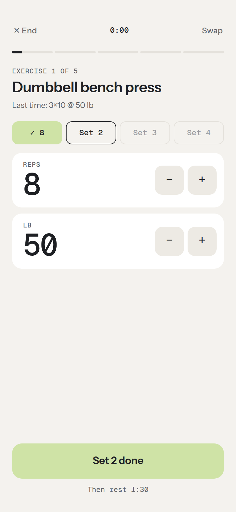
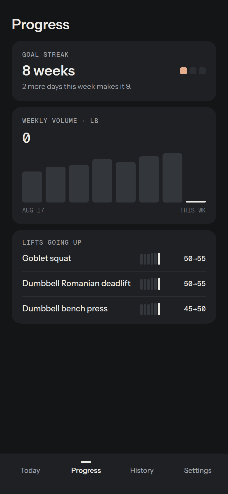

# Training Log

A mobile-first workout planner and tracker built around one idea: **zero decisions to
start**. Open the app and today's workout is already planned for the time you have and
the equipment you own. Tap Start, follow the sets and rest timer, and see your streak and
lifts go up. Walks, runs and sports count too.

**Live app: [train.tejasrj.io](https://train.tejasrj.io)** (works without signing in)

<p>
  
  
  
  
</p>

## Features

- **A workout ready on open.** Today's plan is built automatically, rotating upper body,
  lower body and full body. Tap the title to pick any of 14 focus areas instead, choose
  20, 30 or 45 minutes (or your own), or Shuffle for different exercises.
- **AI planning.** Gemini personalizes the plan from recent workouts and activities and
  says why in one line, through a small proxy that keeps the API key off the client and
  enforces daily limits. Falls back to a curated library of ~170 exercises.
- **Live workout mode.** One set at a time with reps and weight steppers, "last time"
  numbers, an automatic rest timer with a chime and vibration, exercise swaps, and the
  screen kept awake. A reload or locked phone resumes where you left off.
- **Progress you can see.** A weekly goal of active days, a streak of weeks that hit it,
  weekly volume, lifts going up, "better than last time" after each workout, and a
  30-day calendar with PR tags.
- **Equipment-aware.** Choose from 20 equipment presets or add your own.
- **Activities.** Log walks, hikes, pickleball and more with duration, distance and effort.
- **Local-first with cloud sync.** Works offline and signed out. Sign in with Google to
  sync history and settings across devices, or continue as a guest and link Google later.
- **Export and import.** A JSON backup (shared to Files or Drive on phones), a CSV with one
  row per exercise, or a text summary with a prompt to paste into any AI chatbot.
- **Day and Night themes**, or match the system setting.
- **Installable PWA** on iOS and Android, with the app shell cached for offline use.

## How it works

See [docs/architecture.md](docs/architecture.md) for a diagram and an overview of the data flow.

| Layer | Implementation |
|---|---|
| UI | Single-page vanilla HTML/CSS/JS, no build step or framework |
| Planning | Greedy time-budget packer over a curated library (`exercises.js`), rotating across muscle groups and ranked by how recently each exercise was done |
| Stats | Pure functions in `stats.js` (weeks, goal history, streak, volume, lift trends, PRs), unit tested in Node |
| Live workout | Session state saved on every change; the rest timer derives from a timestamp, plus Web Audio, Vibration and Screen Wake Lock APIs |
| Storage | `localStorage` is the source of truth on each device |
| Sync | Firebase Authentication (Google and anonymous) + Cloud Firestore |
| Offline | Service worker with stale-while-revalidate caching |
| AI | Gemini API behind a Cloudflare Worker (`worker/`) that verifies Firebase ID tokens and enforces tiered daily limits |
| Hosting | GitHub Pages with a custom domain |

**Sync model.** Every change is written locally first, then mirrored to
`users/{uid}/workouts/{id}` and `users/{uid}/settings/profile`. A sync runs on sign-in,
on demand, and when the app returns to the foreground. Workouts merge by id, deletions
on one device propagate to the others instead of being restored, and equipment and
settings use last-write-wins. The theme is per device.

## Project structure

```
index.html            Markup for the screens, sheets and tab bar
styles.css            Design tokens (Day/Night themes) and components
app.js                State, Today plan, live workout, progress, history, export and sync logic
stats.js              Derived stats: weeks, goal and streak, volume, lift trends, PRs
exercises.js          Exercise library, focus areas, equipment and the workout builder
firebase-sync.js      Firebase Auth + Firestore wrapper, loaded as an ES module
sw.js                 Service worker for offline support
manifest.webmanifest  PWA manifest
firestore.rules       Firestore security rules
icons/                App icons
docs/design/          Design spec and build plan for the redesign
docs/screenshots/     README images
tests/                Unit tests for stats.js
worker/               Cloudflare Worker AI proxy (see worker/README.md)
CLAUDE.md             Project notes for AI coding assistants
```

## Running locally

No dependencies or build step. Serve the folder over HTTP (service workers and
Google sign-in don't work from `file://`):

```bash
python3 -m http.server 8000
# open http://localhost:8000
```

Tests:

```bash
node tests/stats.test.js       # stats
cd worker && npm test          # AI proxy
```

## Deployment

The site is served by GitHub Pages from the `main` branch. The `CNAME` file and a
DNS CNAME record point `train.tejasrj.io` at it.

To deploy your own copy:

1. Create a Firebase project, enable **Google** and **Anonymous** sign-in, and create a
   Firestore database.
2. Publish the rules in `firestore.rules`.
3. Replace the config object in `firebase-sync.js` with your project's web config.
4. Add your domain under Authentication → Settings → Authorized domains.
5. Enable GitHub Pages (or any static host) for the repository.

## Security and privacy

- The Firebase web config is a public identifier, not a secret. Access is enforced by
  the Firestore rules: each user can read and write only their own documents.
- The Gemini API key lives only in the Worker's secret store. The Worker accepts requests
  only from the app's origin, verifies Firebase ID tokens for signed-in users, and limits
  signed-out use per IP (stored hashed) and in total.
- All user- and model-generated text is HTML-escaped before rendering.

## Data model

```jsonc
// Strength workout
{
  "id": 1759276800000,
  "date": "2026-10-01T13:00:00.000Z",
  "duration": 35,
  "region": "upper",
  "exercises": [
    // "log" (optional) records every set from live workout mode
    { "name": "Dumbbell bench press", "sets": 3, "reps": 8, "weight": 45,
      "log": [{ "reps": 8, "weight": 45 }, { "reps": 8, "weight": 45 }, { "reps": 7, "weight": 45 }] },
    { "name": "Plank", "sets": 3, "reps": 45, "weight": 0, "unit": "sec" }
  ]
}

// Activity
{
  "id": 1759363200000,
  "date": "2026-10-02T13:00:00.000Z",
  "type": "activity",
  "activity": "Outdoor walk",
  "duration": 40,
  "effort": "Easy",
  "distance": 2.3,
  "distanceUnit": "mi",
  "exercises": []
}
```

Exercise `unit` is omitted for reps, `"sec"` for timed sets and `"min"` for steady
cardio blocks.

## Roadmap

- [x] Time- and focus-based suggestions from a curated, equipment-aware library
- [x] Strength and activity logging with history
- [x] Installable PWA with offline support
- [x] Cross-device sync with Google sign-in and guest accounts
- [x] Hosted at [train.tejasrj.io](https://train.tejasrj.io)
- [x] AI suggestions through a server-side proxy with tiered daily limits
- [x] Redesign: Day/Night themes, one-tap Today, live workout mode, progress and streaks
- [ ] Recovery map from everything logged, feeding the automatic focus and the AI
- [ ] Routines, including a low-energy "bad day" routine
- [ ] Per-set "felt easy" taps to drive weight progression
